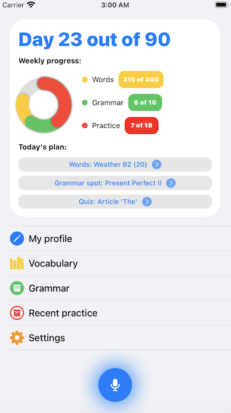

# English learning app

> Speaking is the most complex part of learning new language. 
This app is all about learning english through speaking. Just press "speak" button and start your journey. 

### Features

- SwiftUI 2 (iOS 14) with LazyGrids
- WidgetKit (iOS 14) (small/medium/large) sizes supported
- Combine (Rx approarch for async tasks)
- Speech recognizion 
- Voice synthesis (for words spelling)

#### Home

#### Widgets
See you summary on home screen. Choose any size of widget that appropriate for you. 

#### Learn new words
Voice synthesis spells a word, then you should speak it in order to proceed

#### Quiz
Answer the quiz by voice

#### Practice
Practice speaking by answering questions on topics, then get report regarding your performance

### Server mock

The app utilize mock server deployed on (https://github.com/maybach93/Learning-api-server) repo. So, for the moment all API requests are static.

